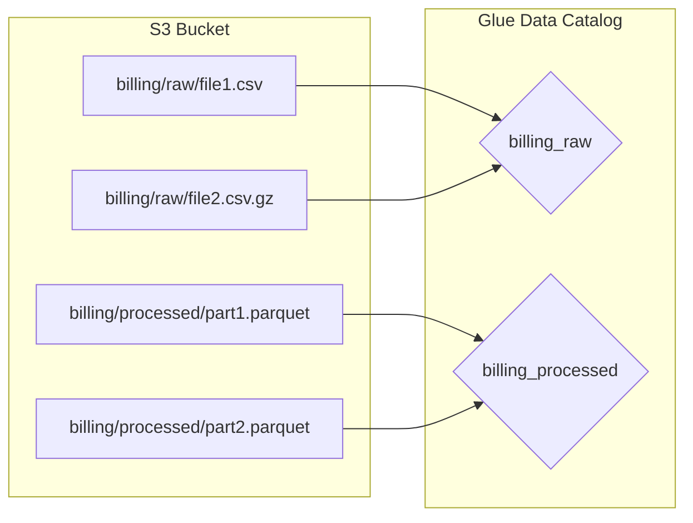
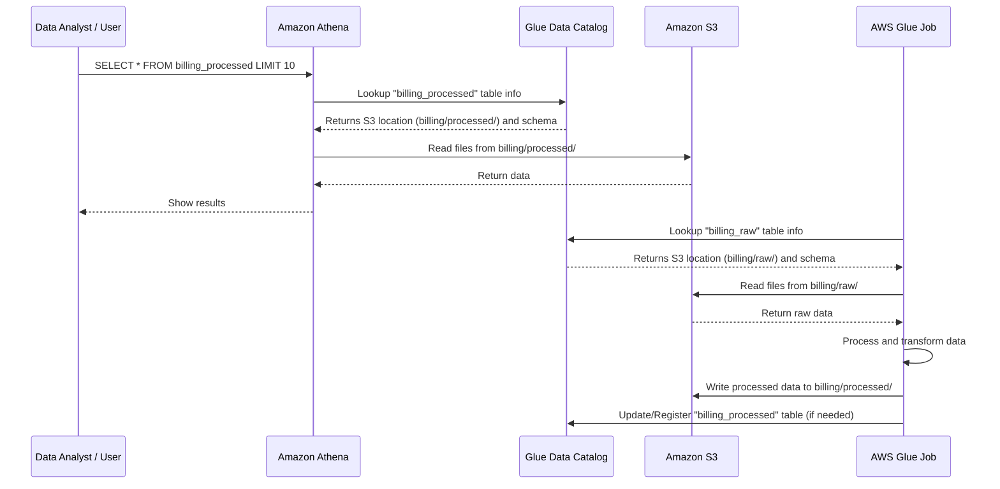
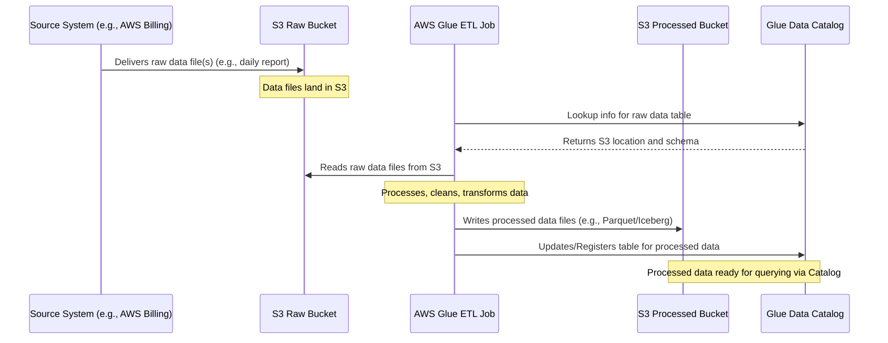
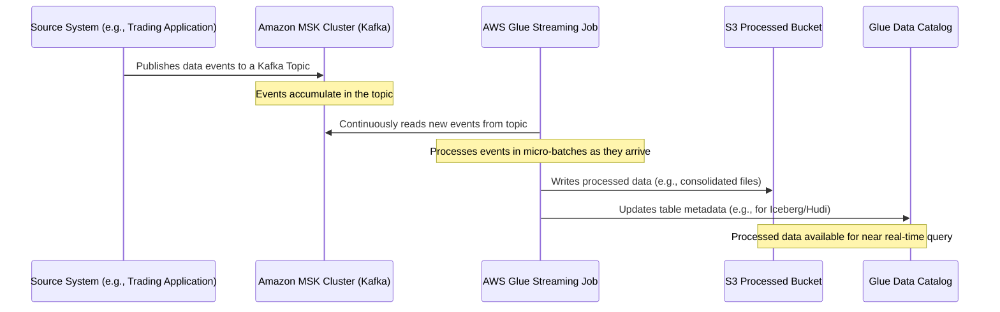
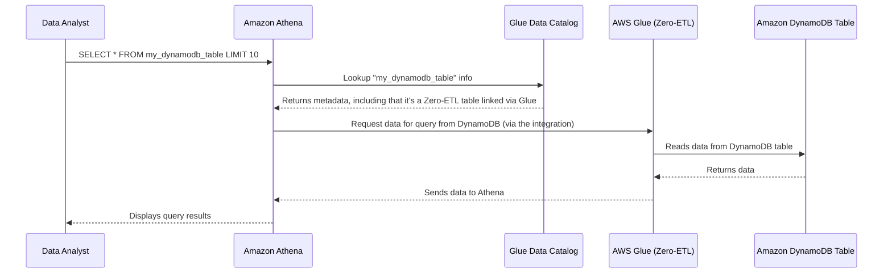
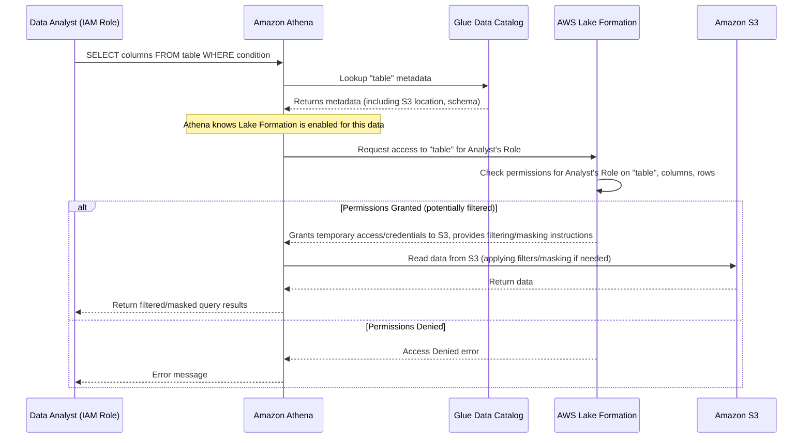
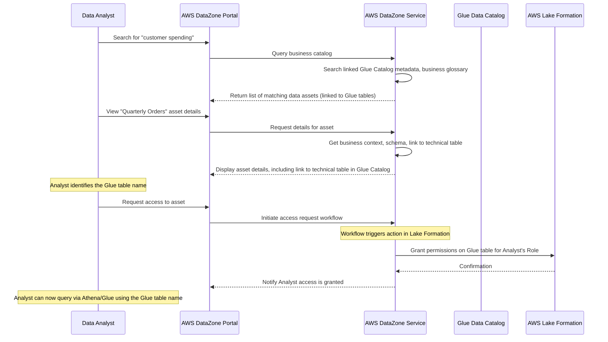
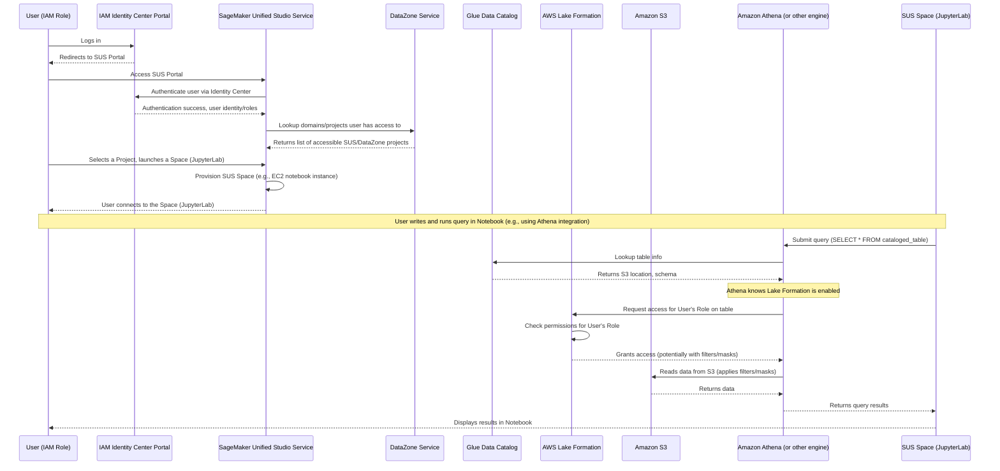
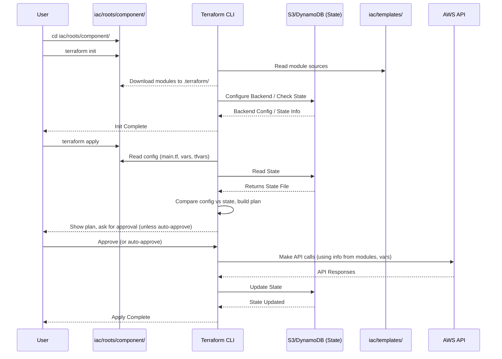
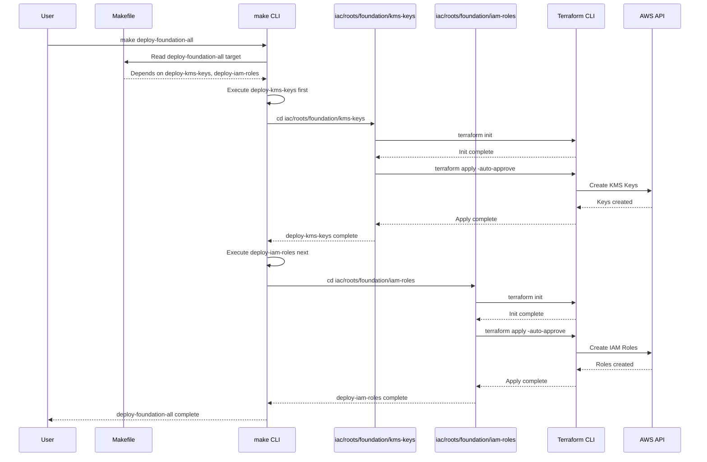

# # AWS VHT-DS Details 
(based on DAIVI architecture)


# Chapter 3 - Data Lakehouse Architecture<!-- {"fold":true} -->

it's time to talk about the heart of any data analytics project: **the data itself!** Where do we put it? How do we find it? How do we analyze it efficiently when there's a massive amount of it, coming in all shapes and sizes?

Storing vast amounts of data can be expensive and complex. Traditional databases are great for structured data and fast queries, but they struggle with truly massive scales and different data formats (like logs or images). Data lakes (like just dumping files into S3) are cheap and scalable but make it hard to find and query data without a lot of extra work.

We need something that gives us the best of both worlds: the scalability and low cost of storing raw data, combined with the ability to easily structure, catalog, and query that data like a database. This is where the **Data Lakehouse Architecture** comes in.

## What is a Data Lakehouse?

Think of our data platform as a large, modern library.

* **Data Lake (Amazon S3):** This is like the entire library building and all the shelves. You can store any kind of "book" (data file) here – structured novels, semi-structured magazines, or even unstructured audiobooks and videos. It's inexpensive and can hold an almost infinite number of items. However, without organization, finding a specific book is hard.
* **Data Warehouse (Analogy: Traditional Database):** This is like a special section in the library where all the books are strictly organized by genre, author, and title, and there's a precise catalog. It's great for quickly finding specific, well-organized books, but it only works for certain *types* of books (structured) and building/maintaining this section for *all* books is very expensive and time-consuming.

A **Data Lakehouse** is an architecture that tries to be the *entire modern library*, combining the massive, flexible storage of the "lake" (S3) with the organizational power and easy query capabilities typically found in a "warehouse".

In AWS, this pattern uses several services together:

* **Amazon S3:** Still the scalable, cheap storage layer (the shelves).
* **AWS Glue Data Catalog:** The central card catalog for the *entire* library. It doesn't store the data itself, but it knows *where* the data files are on S3, *what format* they are in (like CSV, Parquet, or Iceberg), and *what the structure (schema)* of the data looks like.
* **Amazon Athena:** The smart librarian or search engine. It allows you to ask questions (using standard SQL) about the data listed in the Glue Data Catalog, and it figures out how to read the relevant files directly from S3 to get your answer. You don't need to load the data into a separate database first.
* **AWS Glue Jobs:** The library staff who help organize, clean, transform, and prepare data. They can read raw data from S3, process it, and write it back to S3 in a more organized format, updating the Glue Data Catalog along the way.
* **AWS Lake Formation:** The library's security system and access control. It manages who is allowed to read which data (down to specific tables, columns, or even rows) based on the information in the Glue Data Catalog. (We'll cover this in more detail in [Chapter 6: Data Governance and Cataloging](06_data_governance_and_cataloging_.md)).

The key idea is that you store data in S3 (the Lake part) but add a layer of metadata and governance (using Glue Data Catalog and Lake Formation) and use services like Athena and Glue Jobs to interact with that data directly on S3, giving you the benefits of a Data Warehouse structure without the need for a separate, expensive data warehouse storage.

## Solving the Use Case: Storing and Querying Different Data

Our project uses this Data Lakehouse pattern to handle various types of data, such as AWS Cost and Usage Reports (CUR), AWS Resource Inventory, and Splunk logs. Each of these datasets might arrive in different formats or require different processing, but we want to be able to query them all using standard tools.

Here's how the Data Lakehouse helps:

1. **Data Arrives:** Raw data files (e.g., a new AWS CUR file) land in a specific S3 bucket ([Chapter 2](02_foundational_infrastructure_.md) helped us set up secure S3 buckets).
2. **Data Cataloging:** A process (often a Glue Crawler or a Glue Job that updates the catalog) scans the new data file(s) in S3, figures out their format and structure, and registers this information as a table in the AWS Glue Data Catalog. The catalog entry points back to the S3 location.
3. **Querying (Raw Data):** A Data Analyst can now use Amazon Athena to query this newly registered table using SQL, even if it's still in its raw format. Athena uses the catalog information to find and read the specific file(s) in S3 needed for the query.
4. **Processing/Transforming (ETL):** A Glue Job runs to read the raw data (using the catalog entry), cleans it up, transforms it into a more efficient format (like Parquet or Iceberg), and writes it to a different location in S3.
5. **Cataloging (Processed Data):** The Glue Job or another process updates the Glue Data Catalog to register the *new*, transformed data in S3 as a new table.
6. **Querying (Processed Data):** Analysts and ML Engineers can now query the *processed* data table in the catalog using Athena or other tools like SageMaker ([Chapter 7](07_sagemaker_unified_studio__sus__.md)). The processed data is usually more optimized for analytics, making queries faster and cheaper.

This pattern is repeated for each type of data (Billing, Inventory, Splunk), creating separate "domain-specific" lakehouses within the larger architecture.

## Key Components in Action

Let's look at some simplified examples showing how these components interact.

First, the **Storage (S3)** and **Catalog (Glue Data Catalog)**. Your data sits in S3. The Glue Catalog acts as the map.



The `billing_raw` table entry in the catalog knows about the CSV/GZ files in `billing/raw/`. The `billing_processed` table entry knows about the Parquet files in `billing/processed/`.

Now, let's see the **Query Layer (Athena)** and **Processing Layer (Glue Job)** interacting with this.



This diagram shows how Athena reads data for queries and how a Glue Job reads raw data, processes it, writes it back, and updates the catalog.

### A Look at Glue Processing Code

Let's peek into a simplified version of the Glue Job code from the project (like `iac/roots/datalakes/inventory/inventory_dynamic.py`) to see how it interacts with the data and catalog.

First, the job needs to read data. It often reads from a temporary table created by a crawler that scanned the raw data file that just landed in S3.

```python
# Simplified snippet from inventory_dynamic.py

# Assume TARGET_DATABASE_NAME and crawler_table_name are defined
logger.info(f"Loading data from {TARGET_DATABASE_NAME}.{crawler_table_name}")

try:
    # Use GlueContext to read from the cataloged table
    dynamic_frame = glueContext.create_dynamic_frame.from_catalog(
        database=TARGET_DATABASE_NAME,
        table_name=crawler_table_name
    )

    # Convert to a Spark DataFrame for processing
    source_df = dynamic_frame.toDF()
    logger.info(f"Successfully loaded data with {source_df.count()} rows")

except Exception as e:
    logger.error(f"Error loading data: {str(e)}")
    # Handle error, maybe fall back to reading directly from S3 path
```
*Explanation:* This code snippet shows how a Glue Job uses the `glueContext` to easily read data by referencing the table name in the Glue Data Catalog (`TARGET_DATABASE_NAME`, `crawler_table_name`), rather than needing the exact S3 path and file format details. It then converts the data into a Spark DataFrame, which is easier to work with for transformations.

After processing, the job writes the data back to S3, often in a more analytical-friendly format like Parquet or Iceberg. The project specifically uses [Apache Iceberg](https://iceberg.apache.org/), an open table format that adds powerful features like schema evolution, time travel, and partition evolution on top of files stored in S3. When writing using Iceberg format and `saveAsTable`, Glue automatically updates the Glue Data Catalog.

```python
# Simplified snippet from inventory_dynamic.py (continued)

# Assume source_df contains the processed data
# Assume ICEBERG_S3_PATH and ICEBERG_TABLE_NAME are defined
logger.info(f"Writing data to Iceberg table {ICEBERG_TABLE_NAME} at {ICEBERG_S3_PATH}")

try:
    # Write the Spark DataFrame as an Iceberg table
    source_df.write \
        .format("iceberg") \
        .option("write-format", "parquet") \
        .mode("append") # Use "append" to add new data, "overwrite" to replace
        .option("path", ICEBERG_S3_PATH) # Specify S3 location
        .saveAsTable(f"{TARGET_DATABASE_NAME}.{ICEBERG_TABLE_NAME}") # Create/Update catalog table

    logger.info(f"Successfully wrote data to Iceberg table")

except Exception as e:
    logger.error(f"Error writing data: {str(e)}")
    # Handle error
```
*Explanation:* This snippet demonstrates writing the processed `source_df`.
* `.format("iceberg")`: Specifies the Iceberg format.
* `.option("write-format", "parquet")`: Tells Iceberg to store the actual data files as Parquet, which is column-oriented and good for analytics.
* `.mode("append")`: Adds the new data to the existing table. Other modes like `overwrite` replace the data.
* `.option("path", ICEBERG_S3_PATH)`: The S3 location where Iceberg will store the data and metadata files.
* `.saveAsTable(...)`: This crucial part registers or updates the `ICEBERG_TABLE_NAME` in the `TARGET_DATABASE_NAME` within the Glue Data Catalog, pointing to the Iceberg data in S3.

By using `saveAsTable` with the Iceberg format, the Glue Job not only writes the data files to S3 but also manages the table metadata in the Glue Data Catalog, ensuring that Athena (and other tools integrated with the Glue Catalog) can immediately discover and query the newly processed data.

The `iac/roots/datalakes/billing/terraform.tfvars` file referenced in the concept details shows how the *infrastructure* for a specific lakehouse (Billing) is configured, defining the S3 buckets (`BILLING_DATA_BUCKET`, `BILLING_ICEBERG_BUCKET`), Glue role (`GLUE_ROLE_NAME`), etc., that support this architecture.

You can explore the actual data lakehouse implementation in your deployed environment using the guides like [Exploring DAIVI Data Lakehouse](exploring-daivi-data-lakehouse.md) and [Exploring AWS Lake Formation Components](exploring-daivi-lake-formation.md), which show you the S3 buckets, Glue databases and tables, and Lake Formation permissions in the AWS Console.

## Conclusion

In this chapter, we introduced the Data Lakehouse Architecture, the core pattern used in this project for storing and analyzing data. We learned how it combines the cost-effectiveness and scalability of data lakes (S3) with the structure and query capabilities of data warehouses, using services like AWS Glue Data Catalog, Amazon Athena, and AWS Glue Jobs.

We saw how the Glue Data Catalog acts as the central registry, enabling services like Athena and Glue Jobs to understand and interact with data stored directly in S3. We also got a glimpse of how Glue Jobs are used to process data and manage table metadata using formats like Iceberg.

With our foundational infrastructure ready and our data lakehouse pattern understood, we are now ready to delve into how data actually *flows* through this system.

In the [next chapter](04_data_pipelines_and_processing_.md), we will explore the **Data Pipelines and Processing**, looking at how data is ingested, transformed, and made ready for analysis using AWS Glue Workflows and Jobs.

---

<sub><sup>Generated by [AI Codebase Knowledge Builder](https://github.com/The-Pocket/Tutorial-Codebase-Knowledge).</sup></sub> <sub><sup>**References**: [[1]](https://github.com/aws-samples/sample-pace-data-analytics-ml-ai/blob/ba80256f96479ccb59ac4c2e718d31dc8a1e0fa9/docs/demo/exploring-daivi-data-lakehouse.md), [[2]](https://github.com/aws-samples/sample-pace-data-analytics-ml-ai/blob/ba80256f96479ccb59ac4c2e718d31dc8a1e0fa9/docs/demo/exploring-daivi-lake-formation.md), [[3]](https://github.com/aws-samples/sample-pace-data-analytics-ml-ai/blob/ba80256f96479ccb59ac4c2e718d31dc8a1e0fa9/iac/roots/datalakes/billing/terraform.tfvars), [[4]](https://github.com/aws-samples/sample-pace-data-analytics-ml-ai/blob/ba80256f96479ccb59ac4c2e718d31dc8a1e0fa9/iac/roots/datalakes/inventory/inventory_dynamic.py)</sup></sub>


---

# Chapter 4: Data Pipelines and Processing<!-- {"fold":true} -->

Welcome back! In our journey to build a powerful data platform, we've already established a secure foundation ([Chapter 1: IAM Identity Center & Roles](01_iam_identity_center___roles_.md) and [Chapter 2: Foundational Infrastructure](02_foundational_infrastructure_.md)) and built the core structure for storing and organizing our data – the Data Lakehouse ([Chapter 3: Data Lakehouse Architecture](03_data_lakehouse_architecture_.md)).

But how does the data actually *get* into this Data Lakehouse? Data rarely starts out clean, organized, and sitting neatly in S3 waiting to be cataloged. It comes from various sources – databases, applications, logs, external feeds – and often needs cleaning, transformation, and structuring before it's truly ready for analysis or machine learning.

This is the job of **Data Pipelines and Processing**. Think of them as the system of conveyor belts, sorting machines, and processing plants that take raw materials (your data) and prepare them for storage in the warehouse (your Data Lakehouse). They are the automated workflows that move data from its origin, clean it up, change its shape if needed (like converting formats or aggregating values), and deliver it to the right place in your S3 data lake, ensuring it's properly registered in the Glue Data Catalog.

Without robust data pipelines, your Data Lakehouse would be empty, or worse, full of messy, unusable data. Pipelines ensure the data is timely, accurate, and in the right format for analysts and ML engineers.

Our project uses different types of pipelines to handle data arriving in different ways:

* **Batch Processing:** For data that arrives periodically (e.g., daily reports).
* **Streaming Processing:** For data that arrives continuously (e.g., real-time events).

Let's explore these two main types.

## Batch Processing: Handling Data in Chunks

Imagine you receive large reports (like billing details or inventory lists) once a day. You don't need to process every single line the moment it's generated. You can collect the report file, and then process the whole thing together. This is **batch processing**.

* **Use Case:** Processing daily billing files, weekly inventory dumps, monthly historical data archives.
* **AWS Service:** AWS Glue ETL Jobs. Glue Jobs are serverless Spark or Python jobs that can read data from many sources (including files in S3 or tables in the Glue Data Catalog), perform transformations (ETL: Extract, Transform, Load), and write the results to a destination.

In our project, data sources like AWS Cost and Usage Reports (CUR) or EC2 Inventory files often arrive in S3 on a schedule. We use AWS Glue jobs to pick up these files, apply logic (like cleaning, standardizing columns, or converting formats), and write the processed data back to S3, often in a more query-optimized format like Parquet or Iceberg, and ensuring it's registered in the Glue Data Catalog.

### How a Batch Pipeline Works (Conceptually)



This diagram shows the flow: the source drops the file in S3, a Glue Job is triggered (often on a schedule), it reads the data, processes it, and writes the output to a different S3 location, making sure the Glue Data Catalog knows about the new, processed data.

### A Glimpse at a Glue Batch Job Script

The project uses Python scripts executed by AWS Glue. Here's a simplified snippet from `iac/roots/datalakes/billing/billing_hive.py` (note: the actual billing pipeline might be more complex and use Iceberg, but this snippet shows a basic read/write pattern demonstrated in the code):

```python
# Simplified snippet from billing_hive.py
import sys
from awsglue.utils import getResolvedOptions
from pyspark.context import SparkContext
from awsglue.context import GlueContext

# Get job arguments
args = getResolvedOptions(sys.argv, ['JOB_NAME', 'SOURCE_FILE', 'DATABASE_NAME', 'TABLE_NAME'])
SOURCE_FILE = args.get("SOURCE_FILE")
DATABASE_NAME = args.get("DATABASE_NAME")
TABLE_NAME = args.get("TABLE_NAME")

# Initialize Glue and Spark
sc = SparkContext()
glueContext = GlueContext(sc)
spark = glueContext.spark_session

print(f"Reading source CSV file: {SOURCE_FILE}")

# Read the source file (CSV in this example)
source_df = spark.read.csv(SOURCE_FILE, header=True, inferSchema=True)

print(f"Loaded {source_df.count()} rows.")

# Write the data into a table managed by Glue Data Catalog
# This assumes the table schema is already defined in the catalog
# Data is written to S3 location associated with the catalog table
source_df.write.mode("append").saveAsTable(f"{DATABASE_NAME}.{TABLE_NAME}")

print(f"Successfully wrote data to {DATABASE_NAME}.{TABLE_NAME}")
```

*Explanation:*
1. The script gets input arguments, including the location of the `SOURCE_FILE` in S3 and the target `DATABASE_NAME.TABLE_NAME` in the Glue Data Catalog.
2. It initializes the Glue and Spark environments.
3. `spark.read.csv(SOURCE_FILE, ...)` reads the data directly from the specified S3 path.
4. `source_df.write.mode("append").saveAsTable(f"{DATABASE_NAME}.{TABLE_NAME}")` writes the content of the DataFrame to S3 at the location associated with the specified table in the Glue Data Catalog. `mode("append")` adds the new data to the existing table data. Using `saveAsTable` automatically updates the catalog metadata.

This simple script demonstrates the core steps: read from a source location (S3 file), potentially perform transformations (not shown here for brevity), and write to a target cataloged table (which implies writing to S3 under the hood).

## Streaming Processing: Handling Data as it Arrives

Some data needs to be processed immediately or near-real-time. Think of financial trades, sensor readings, or website clicks. Waiting for a daily batch job would mean reacting too late. This is where **streaming processing** comes in.

* **Use Case:** Processing live stock trades, real-time application logs, IoT device data streams.
* **AWS Services:**
  * **Amazon MSK (Managed Streaming for Apache Kafka):** A service that makes it easy to run Apache Kafka. Kafka is like a high-speed, highly durable queue for streaming data. Source systems write data to Kafka "topics", and processing applications read from those topics.
  * **AWS Glue Streaming Jobs (using Spark Structured Streaming) or Amazon Kinesis Data Analytics for Apache Flink:** These services can connect to a stream (like an MSK topic), process the data records as they arrive, and write them to a destination. The project uses Glue Streaming for some pipelines (`trade.py`) and includes a Flink application example (`KafkaStreamingJob.java`). Glue Streaming is often easier for Python/Spark users, while Flink offers powerful stream processing capabilities, often used with Java/Scala.

For real-time data like trades or stock prices, data sources would publish events to an MSK topic. A Glue Streaming job (or a Flink application) would continuously read from that topic, process the incoming data (e.g., parsing JSON, adding timestamps), and write it to a destination, often a temporary staging area in S3 that is later consolidated, or directly to a streaming-compatible table format like Iceberg in S3, cataloged by Glue.

### How a Streaming Pipeline Works (Conceptually)



This diagram illustrates a streaming flow: the source sends data events to MSK, a Glue Streaming job is constantly listening to the MSK topic, processing small groups (micro-batches) of incoming events, and writing them out to S3/Catalog, making the data available for analysis very quickly.

### A Glimpse at a Glue Streaming Job Script

The project includes an example of a Glue Streaming job using Spark Structured Streaming to read from Kafka (`iac/roots/datalakes/trade/trade.py`):

```python
# Simplified snippet from trade.py
import sys
from awsglue.utils import getResolvedOptions
from pyspark.context import SparkContext
from awsglue.context import GlueContext
from awsglue.job import Job

# Get job arguments
args = getResolvedOptions(sys.argv, ['JOB_NAME', 'CONNECTION_NAME', 'TOPIC_NAME', 'DATA_DATABASE_NAME', 'DATA_TABLE_NAME'])
CONNECTION_NAME = args.get("CONNECTION_NAME") # Glue connection to MSK
TOPIC_NAME = args.get("TOPIC_NAME")
DATA_DATABASE_NAME = args.get("DATA_DATABASE_NAME")
DATA_TABLE_NAME = args.get("DATA_TABLE_NAME")

# Initialize Glue and Spark
sc = SparkContext()
glueContext = GlueContext(sc)
spark = glueContext.spark_session
job = Job(glueContext)
job.init(args['JOB_NAME'], args)

# Create a streaming DataFrame from Kafka
print(f"Reading from Kafka topic '{TOPIC_NAME}' via connection '{CONNECTION_NAME}'")
streaming_df = glueContext.create_data_frame.from_options(
    connection_type="kafka",
    connection_options={
        "connectionName": CONNECTION_NAME,
        "classification": "json", # Assuming data is JSON
        "startingOffsets": "earliest", # Start reading from the beginning
        "topicName": TOPIC_NAME,
        "inferSchema": "true",
        "typeOfData": "kafka",
        "failOnDataLoss": "false"
    },
    transformation_ctx="kafka_source"
)

# Process each batch of data
def processBatch(data_frame, batchId):
    if (data_frame.count() > 0):
        print(f"Processing batch {batchId} with {data_frame.count()} records")
        # Convert Spark DataFrame batch to Glue DynamicFrame
        batch_dynamic_frame = DynamicFrame.fromDF(data_frame, glueContext, "from_data_frame")

        # Write the batch to the cataloged table
        glueContext.write_dynamic_frame.from_catalog(
            frame=batch_dynamic_frame,
            database=DATA_DATABASE_NAME,
            table_name=DATA_TABLE_NAME,
            # additional_options={} # Options for writing (e.g., format, partitioning)
        )
        print(f"Wrote batch {batchId} to {DATA_DATABASE_NAME}.{DATA_TABLE_NAME}")

# Start the streaming process
print("Starting streaming job...")
glueContext.forEachBatch(frame = streaming_df, batch_function = processBatch, options = {"windowSize": "100 seconds"})

# job.commit() is called automatically by forEachBatch when streaming stops
print("Streaming job started. Will run continuously.")

```

*Explanation:*
1. The script gets arguments specifying the Kafka connection, topic, and target Glue Catalog table.
2. `glueContext.create_data_frame.from_options(...)` creates a Spark Structured Streaming DataFrame that continuously reads data from the specified Kafka topic using the provided connection details.
3. `processBatch(data_frame, batchId)` is a function that will be called by Glue Streaming for each small chunk (micro-batch) of data received from Kafka.
4. Inside `processBatch`, it converts the batch DataFrame to a Glue DynamicFrame and `glueContext.write_dynamic_frame.from_catalog(...)` writes that batch's data to S3 at the location linked to the target Glue Catalog table.
5. `glueContext.forEachBatch(...)` starts the streaming process, repeatedly calling `processBatch` as new data arrives in Kafka, processing data in windows (here, 100 seconds worth of data per batch).

This script shows how Glue Streaming connects to a real-time source (Kafka) and processes data in small, continuous batches, writing them to a cataloged table.

## Defining Pipelines with Infrastructure as Code

Just like our foundational infrastructure and Data Lakehouse structure, the data pipelines themselves (the Glue Jobs, MSK clusters, Flink applications, etc.) are defined using Infrastructure as Code (IaC).

* Terraform is used to define the Glue Jobs (specifying the script to run, memory, role, etc.), MSK clusters (defining size, security groups, subnets - see `iac/roots/foundation/msk-serverless/README.md` for MSK details), and the necessary connections and roles.
* This ensures that your pipelines are defined consistently, are version-controlled, and can be deployed automatically alongside the rest of your infrastructure.

For example, the Terraform code for the billing lakehouse (`iac/roots/datalakes/billing/`) defines the Glue Jobs that process the billing data, referencing the Python scripts and necessary IAM roles (which we learned about in [Chapter 1](01_iam_identity_center___roles_.md)) and the S3 buckets and Glue Data Catalog ([Chapter 3](03_data_lakehouse_architecture_.md)).

## Conclusion

In this chapter, we explored the crucial concept of **Data Pipelines and Processing**. We learned that pipelines are the automated systems responsible for moving, cleaning, and transforming raw data before it lands in our Data Lakehouse.

We looked at the two main types: **Batch Processing** (using AWS Glue ETL jobs for periodic data like reports) and **Streaming Processing** (using services like Amazon MSK and AWS Glue Streaming/Flink for real-time data like trades). We saw simple conceptual diagrams and code snippets showing how these pipelines read from sources, process data, and write to the Data Lakehouse (S3 and Glue Data Catalog). Finally, we noted that these pipelines are also defined and managed using Infrastructure as Code.

With data now flowing into our Data Lakehouse, we can start thinking about how to access and use it easily. Sometimes, getting data from one service to another in AWS *doesn't* require building a complex ETL pipeline.

In the [next chapter](05_zero_etl_integrations_.md), we will explore **Zero-ETL Integrations**, which allow direct connections between certain AWS services, simplifying data access and analysis.

---

<sub><sup>Generated by [AI Codebase Knowledge Builder](https://github.com/The-Pocket/Tutorial-Codebase-Knowledge).</sup></sub> <sub><sup>**References**: [[1]](https://github.com/aws-samples/sample-pace-data-analytics-ml-ai/blob/ba80256f96479ccb59ac4c2e718d31dc8a1e0fa9/iac/roots/datalakes/billing/billing_hive.py), [[2]](https://github.com/aws-samples/sample-pace-data-analytics-ml-ai/blob/ba80256f96479ccb59ac4c2e718d31dc8a1e0fa9/iac/roots/datalakes/stocks/java-app/msf/src/main/java/com/hackathon/KafkaStreamingJob.java), [[3]](https://github.com/aws-samples/sample-pace-data-analytics-ml-ai/blob/ba80256f96479ccb59ac4c2e718d31dc8a1e0fa9/iac/roots/datalakes/trade/trade.py), [[4]](https://github.com/aws-samples/sample-pace-data-analytics-ml-ai/blob/ba80256f96479ccb59ac4c2e718d31dc8a1e0fa9/iac/roots/foundation/msk-serverless/README.md)</sup></sub>


---

# Chapter 5: Zero-ETL Integrations<!-- {"fold":true} -->

Welcome back! In the previous chapter, [Chapter 4: Data Pipelines and Processing](04_data_pipelines_and_processing_.md), we explored how to build automated pipelines (using services like AWS Glue and Amazon MSK) to move and transform data from its raw source into our Data Lakehouse ([Chapter 3: Data Lakehouse Architecture](03_data_lakehouse_architecture_.md)), making it ready for analysis. This traditional approach, often called ETL (Extract, Transform, Load), is essential for cleaning, structuring, and consolidating data at scale.

But what if you have data sitting in *another* AWS service, like a database or a data warehouse you already use, and you just need to run some queries on it *without* copying the whole thing into your Data Lakehouse first? Building a full ETL pipeline just to get read-only access might feel like overkill.

Imagine you have a set of customer orders in a DynamoDB database (a NoSQL database good for fast, item-by-item access) and you want to quickly run some analytics queries on *all* orders using a standard tool like Amazon Athena (which uses SQL). Copying millions or billions of order records from DynamoDB to S3, transforming them, and cataloging them might take time and require building a dedicated pipeline. Wouldn't it be great if Athena could just "look directly" at the DynamoDB data?

This is where **Zero-ETL Integrations** come in.

## What are Zero-ETL Integrations?

Zero-ETL integrations are special patterns designed to let you access data directly from certain AWS source systems (like DynamoDB, or even another data warehouse like Snowflake, although that involves a different type of connection) using your analytics tools, **without needing to build traditional ETL pipelines that copy and transform the data into a central data lake first.**

Think of our Data Lakehouse ([Chapter 3](03_data_lakehouse_architecture_.md)) as our main library building. Traditional ETL pipelines ([Chapter 4](04_data_pipelines_and_processing_.md)) are like bringing books from other smaller libraries or archives, processing them (cataloging, binding, etc.), and adding them to the main library shelves (S3) with entries in the main card catalog (Glue Data Catalog).

A Zero-ETL integration, on the other hand, is like having a **special telescope or direct secure link** from your main library's reading room (where your analysts sit with tools like Athena or SageMaker) that lets you look *directly* at the books or documents still sitting in that smaller library or archive, using the tools in your main reading room. You don't move the books; you just get a direct view into where they are.

These integrations are implemented using specific capabilities within AWS Glue, which acts as the "bridge" or "connector" between the source system and your analytics tools.

## Key Concepts

* **Access Data In Place:** The main idea is that your analytics tool (like Athena) reads data directly from the source (like DynamoDB) without the data being physically copied or moved to a different storage location (like S3) beforehand for the purpose of this query.
* **Avoid Traditional ETL:** You bypass the need for building Glue ETL jobs or other pipelines solely to move the data for analysis.
* **Glue as the Connector:** AWS Glue provides the underlying technology or the "special connectors" that enable these direct links. It manages the connection details and often helps translate between the source data format and a format your analytics tool can understand.
* **Specific Use Cases:** Zero-ETL is great for scenarios where:
  * You need quick analytical access to operational data (e.g., querying live or near-live data in a transactional database).
  * The data doesn't need complex transformations before analysis.
  * The source system is supported by a Zero-ETL integration pattern.

It's important to note that Zero-ETL doesn't *replace* ETL pipelines. Traditional ETL is still necessary for complex data transformations, cleaning, historical archiving, and consolidating data from many disparate sources into a unified format. Zero-ETL is an *alternative* pattern for specific scenarios where direct access is sufficient and beneficial.

## Solving the Use Case: Querying DynamoDB from Athena

Let's use the example of querying a DynamoDB table containing customer order data directly from Amazon Athena.

Normally, to query DynamoDB analytics, you might:
1. Build a Glue ETL job to read data from DynamoDB.
2. Write the data to S3 in a format like Parquet.
3. Create a Glue Data Catalog table pointing to the S3 data.
4. Query the S3 data using Athena.

With a Zero-ETL integration for DynamoDB and Athena, enabled via Glue, the steps are simplified:
1. Set up the Zero-ETL integration in Glue that links a specific DynamoDB table to the Glue Data Catalog.
2. Glue automatically creates or updates a table entry in the Glue Data Catalog that represents the DynamoDB table.
3. You can now query this table directly using Athena, just like any other table in your catalog. Athena uses the Glue integration to read the data from DynamoDB on demand.

This eliminates steps 1 and 2, saving time and resources needed for pipeline development and data storage in S3 *just* for this analytical view.

## How it Works Under the Hood

Setting up a Zero-ETL integration typically involves creating specific resources within AWS Glue that define the connection and mapping between the source and the Glue Data Catalog.

Here's a simplified conceptual flow when an analyst queries a DynamoDB table that has a Zero-ETL integration set up:



This shows that instead of going to S3, Athena is directed by the Glue Catalog to use the Glue Zero-ETL capability to read directly from DynamoDB.

## Defining Zero-ETL with Infrastructure as Code

In this project, Zero-ETL integrations, like the one for DynamoDB, are defined using Infrastructure as Code (Terraform). This means the setup is automated and repeatable.

The project includes code (`iac/roots/z-etl/create_zetl_integration.py` Lambda function, invoked by Terraform) to create these integrations programmatically using the AWS Glue API.

Let's look at simplified examples of the configuration needed and how the Lambda interacts with Glue.

First, the configuration (`iac/roots/z-etl/dynamodb/z-etl-db/terraform.tfvars`) defines the details of the DynamoDB table and the desired integration name, target table name in the catalog, etc.:

```terraform
# Simplified iac/roots/z-etl/dynamodb/z-etl-db/terraform.tfvars
APP                                 = "my-data-platform"
ENV                                 = "dev"
AWS_PRIMARY_REGION                  = "us-east-1"
# ... other foundational details ...
Z_ETL_DYNAMODB_TABLE                = "my-app-dev-equity-orders-db-table" # The Source DynamoDB Table Name
# ... other resources like S3 bucket names, KMS key aliases, Glue role ...

# The Terraform resource that sets up the integration would reference these values
# and pass them to the Lambda function responsible for calling the Glue API.
```

*Explanation:* This file defines the names and key identifiers for the resources involved: the source DynamoDB table (`Z_ETL_DYNAMODB_TABLE`), the application and environment names (`APP`, `ENV`), and the necessary roles and keys ([Chapter 1](01_iam_identity_center___roles_.md), [Chapter 2](02_foundational_infrastructure_.md)). Terraform uses these values to deploy the DynamoDB table itself and configure the Zero-ETL integration *to* this table.

Now, let's look at a simplified snippet from the `create_zetl_integration.py` Lambda function that actually creates the Glue integration using the AWS SDK (Boto3). This Lambda is invoked by Terraform.

```python
# Simplified snippet from iac/roots/z-etl/create_zetl_integration.py

import boto3
import json
import logging

logger = logging.getLogger()
logger.setLevel(logging.INFO)

def create_integration(glue_client, ssm_client, event):
    # Get parameters passed from Terraform via the event
    app = event['app']
    env = event['env']
    source_arn = event['sourceArn'] # ARN of the DynamoDB table
    integration_name = event['integrationName'] # Name for the Glue Integration resource
    target_arn = event['targetArn'] # ARN of the target resource (Glue itself)
    target_table_name = event['targetTableName'] # Name for the table in Glue Catalog
    target_role_arn = event['targetRoleArn'] # Role for Glue to access source

    logger.info(f"Creating integration: {integration_name}")

    # 1. Create the 'Integration Resource Property'
    # This links Glue's capabilities to the target (often Glue itself for query engines)
    glue_client.create_integration_resource_property(
        ResourceArn=target_arn, # e.g., ARN representing Glue capabilities
        TargetProcessingProperties={
            'RoleArn': target_role_arn, # Role Glue uses
            # 'KmsArn': target_kms_key_arn # KMS key for processing if needed
        }
    )

    # 2. Create the main Glue Integration resource
    # This defines the link between the Source (DynamoDB) and the Target (Glue's capabilities)
    integration_result = glue_client.create_integration(
        IntegrationName=integration_name,
        SourceArn=source_arn, # ARN of the DynamoDB table
        TargetArn=target_arn, # ARN of the target Glue capability
        # KmsKeyId=integration_kms_key_arn # KMS key for the integration resource itself
    )

    # 3. Create 'Integration Table Properties'
    # This maps a source table (implicitly the one from SourceArn) to a target table name in the catalog
    glue_client.create_integration_table_properties(
        ResourceArn=integration_result['IntegrationArn'], # The ARN of the created integration
        TableName=target_table_name, # The desired name in the Glue Catalog
        TargetTableConfig={
            'TargetTableName': target_table_name # Redundant but required in API
        }
    )

    logger.info(f"Integration {integration_name} created successfully.")

    # Store created ARNs in SSM Parameter Store for later use/deletion
    # parameter_name = f"/{app}/{env}/zero-etl/{integration_name}"
    # ssm_client.put_parameter(Name=parameter_name, Value=json.dumps(...))

    return {'statusCode': 200, 'body': json.dumps({'message': 'Created'})}

# The lambda_handler function orchestrates calls to create_integration or delete_integration
# ... (rest of the lambda_handler function)
```

*Explanation:*
1. The Lambda function receives necessary information (ARNs, names) via the `event` from Terraform.
2. It initializes a Boto3 `glue_client` to interact with the AWS Glue service.
3. It makes three key API calls:
   * `create_integration_resource_property`: Sets up how Glue will process data *from* the target (in this case, processing data requested *by* Athena/Glue's query engine). It requires a role for Glue to assume.
   * `create_integration`: This is the core call that establishes the link between the source (DynamoDB ARN) and the target (Glue capability ARN).
   * `create_integration_table_properties`: This step connects the created integration to a specific table name (`target_table_name`) that will appear in the Glue Data Catalog. When users query this `target_table_name` in Athena, Glue knows to use this integration to fetch data from the *source* DynamoDB table.
4. The function also includes logic (not shown in full snippet but present in the actual file) to store the resulting integration details (like the Integration ARN) in AWS Systems Manager Parameter Store ([Chapter 2](02_foundational_infrastructure_.md) mentioned SSM briefly as a secure place for configuration) so that Terraform can keep track of the created resource and delete it later if needed.

This process, defined in code and executed by the Lambda function triggered by Terraform, creates the necessary Glue metadata and connections to enable direct queries to the DynamoDB table via the Glue Data Catalog and Athena.

A similar pattern exists for integrating with Snowflake, although the specific Glue connection type and configuration details would differ, relying on a Glue Connection resource that holds Snowflake credentials (often referenced from AWS Secrets Manager - another service for securely storing secrets). The `datazone_connection_handler.py` file, though handling DataZone, illustrates the pattern of a Lambda using credentials (assumed role via STS) to call a service API (DataZone) to create a connection resource, which is conceptually similar to how Terraform might orchestrate creating a Glue Snowflake connection resource. The `iac/roots/z-etl/snowflake/terraform.tfvars` file shows inputs for a Snowflake connection, like referencing a `SNOWFLAKE_SECRET_NAME`.

By using these Zero-ETL integrations, users of the data platform, particularly Data Analysts, can gain access to data residing in these specific sources directly through the Glue Data Catalog ([Chapter 6](06_data_governance_and_cataloging_.md)), simplifying their workflow for certain analytical tasks.

## Conclusion

In this chapter, we explored the concept of **Zero-ETL Integrations**. We learned that this pattern allows analytics services like Amazon Athena to directly query data residing in specific AWS source systems like DynamoDB or Snowflake, bypassing the need for traditional ETL pipelines to copy data into S3 for every analytical use case.

We saw how AWS Glue acts as the central piece enabling these integrations by managing the connections and catalog entries that link analytics tools to the source data location. We also briefly looked at how Infrastructure as Code (Terraform, via a Lambda helper function) is used to configure these integrations, ensuring they are defined and deployed reliably.

Understanding Zero-ETL adds another tool to our data platform's capabilities, providing flexibility to access data where it lives for appropriate use cases.

Now that we understand how data can get into our Data Lakehouse via pipelines ([Chapter 4](04_data_pipelines_and_processing_.md)) and how we can sometimes query it directly in place via Zero-ETL integrations, the next crucial step is organizing and governing all this data so users can find it easily and access it securely.

In the [next chapter](06_data_governance_and_cataloging_.md), we will dive into **Data Governance and Cataloging**, focusing on services like AWS Lake Formation and the Glue Data Catalog to manage access and discoverability of data across the platform.

---

<sub><sup>Generated by [AI Codebase Knowledge Builder](https://github.com/The-Pocket/Tutorial-Codebase-Knowledge).</sup></sub> <sub><sup>**References**: [[1]](https://github.com/aws-samples/sample-pace-data-analytics-ml-ai/blob/ba80256f96479ccb59ac4c2e718d31dc8a1e0fa9/iac/roots/sagemaker/snowflake-connection/src/lambda/datazone_connection_handler.py), [[2]](https://github.com/aws-samples/sample-pace-data-analytics-ml-ai/blob/ba80256f96479ccb59ac4c2e718d31dc8a1e0fa9/iac/roots/z-etl/create_zetl_integration.py), [[3]](https://github.com/aws-samples/sample-pace-data-analytics-ml-ai/blob/ba80256f96479ccb59ac4c2e718d31dc8a1e0fa9/iac/roots/z-etl/dynamodb/z-etl-db/terraform.tfvars), [[4]](https://github.com/aws-samples/sample-pace-data-analytics-ml-ai/blob/ba80256f96479ccb59ac4c2e718d31dc8a1e0fa9/iac/roots/z-etl/snowflake/terraform.tfvars)</sup></sub>

# Chapter 6: Data Governance and Cataloging<!-- {"fold":true} -->

Welcome back! In our journey so far, we've built the secure foundation ([Chapter 1: IAM Identity Center & Roles](01_iam_identity_center___roles_.md), [Chapter 2: Foundational Infrastructure](02_foundational_infrastructure_.md)), set up our scalable storage and organization structure – the Data Lakehouse ([Chapter 3: Data Lakehouse Architecture](03_data_lakehouse_architecture_.md)), and learned how to get data into it using pipelines ([Chapter 4: Data Pipelines and Processing](04_data_pipelines_and_processing_.md)) or even query it directly in place ([Chapter 5: Zero-ETL Integrations](05_zero_etl_integrations_.md)).

Now we have data flowing in, organized in S3, and cataloged in the Glue Data Catalog. But as the amount of data grows and more people across the organization need access, a new challenge emerges: **How do people find the data they need, understand what it means, and know if they are allowed to use it?**

Imagine our large library again. We've filled the shelves (S3), built the main catalog (Glue Data Catalog), and even have systems to bring in new books (Pipelines) or peek at books still in other rooms (Zero-ETL). But if someone comes looking for "all reports about customer spending in the last quarter," how do they:

1. **Discover** that such reports exist and where they are stored?
2. **Understand** the reports – what do the column names mean? Where did the data come from?
3. **Access** the reports – are they allowed to see sensitive customer information? Can they see data from all customers or just specific regions?

This is the challenge of **Data Governance and Cataloging**. It's about making data discoverable, understandable, and securely accessible according to rules and policies. Without it, your Data Lakehouse can become a "data swamp" – a place where data goes to get lost and unused.

## What is Data Governance and Cataloging?

It's the combination of tools and processes that ensure data is managed responsibly throughout its lifecycle. In our project, we use two key AWS services that work together to achieve this:

1. **AWS DataZone:** This is like the **business index and discovery portal** for our library. It provides a user-friendly interface where people can search for data assets using business terms. It includes business glossaries, descriptions, and organizes data into "domains" and "projects" that reflect the organizational structure or lines of business. DataZone helps users find the *right* data and understand its business context. It also provides a layer for managing access requests at a higher, business level.
2. **AWS Lake Formation:** This is the **security guard and detailed rulebook** for the data stored in S3 and cataloged in the Glue Data Catalog. It allows you to define fine-grained access permissions – not just "yes/no" access to an entire S3 bucket, but "yes, you can read this specific *table*, but only these *columns* (column-level permissions) and only the *rows* where the 'Region' is 'North America' (row-level permissions)". Lake Formation enforces these rules when services like Athena, Glue, or Redshift Spectrum try to access the data via the Glue Catalog.

Together, DataZone helps users **discover** and **understand** data assets, while Lake Formation ensures they can **access** the data securely based on defined policies, enforced at a granular level. DataZone works *with* Lake Formation by integrating access policies and presenting catalog information managed by Lake Formation and Glue.

## Solving the Use Case: Secure Data Access and Discovery

Let's revisit our use case: An analyst needs to query customer spending reports.

* **Without Governance/Cataloging:** The analyst might not know where the reports are, what tables exist in the Glue Catalog, or whom to ask for access. If they get access to the S3 bucket via IAM, they might accidentally see sensitive data they shouldn't, or conversely, broad S3 policies might make it impossible to grant narrow access needed for analysis without risking over-privileging.
* **With DataZone and Lake Formation:**
  1. The analyst logs into the DataZone portal.
  2. They search for "customer spending reports" using business terms.
  3. DataZone shows them matching data assets (which are linked to tables in the Glue Catalog), provides descriptions, source information, and potentially data quality details.
  4. They see a specific asset like "Quarterly Customer Orders" and understand its columns via the business glossary.
  5. If they don't have access, they can request it through the DataZone workflow.
  6. An administrator or data steward grants them access *via Lake Formation*, specifying that the analyst's IAM role ([Chapter 1](01_iam_identity_center___roles_.md)) can only `SELECT` from the `quarterly_customer_orders` table, excluding the `customer_name` column, and potentially applying a row filter based on their team (e.g., `WHERE region = 'EMEA'`).
  7. The analyst opens their query tool (like Athena, which is integrated with Lake Formation). They query the `quarterly_customer_orders` table.
  8. Lake Formation intercepts the query, checks the analyst's permissions for *that specific table, columns, and rows*, and only allows access to the data they are permitted to see. The data returned by Athena is automatically filtered and masked according to the Lake Formation rules.

This process provides a secure, governed, and user-friendly way to interact with the data lake.

## Key Components in Action

Let's look at the core components and how they interact.

* **Glue Data Catalog:** The technical catalog. Contains metadata (schema, location) for tables stored in S3 (or linked via Zero-ETL).
* **AWS Lake Formation:** The permission layer on top of the Glue Catalog and S3.
* **AWS DataZone:** The business layer for discovery, understanding, and access workflows, built *on top of* Glue Catalog and integrating with Lake Formation.
* **IAM Identity Center/IAM Roles:** The identities granted permissions *by* Lake Formation.
* **Query Engine (e.g., Athena):** The service used to query the data via the Glue Catalog.

Here's a simplified view of how Lake Formation enforces permissions:



This diagram shows Lake Formation acting as an intermediary when Athena tries to access cataloged data in S3. It checks permissions before granting access to the underlying files.

AWS DataZone adds the discovery and business context layer on top:



This shows DataZone as the entry point for discovery and access requests, leveraging Glue Catalog and Lake Formation behind the scenes.

You can explore these components in your deployed environment using the guides like [Exploring AWS Lake Formation Components](exploring-daivi-lake-formation.md) and [Exploring Amazon SageMaker Unified Studio and DataZone](exploring-daivi-sus.md) (as SageMaker Unified Studio integrates with DataZone).

## Defining Governance and Cataloging with Infrastructure as Code

Setting up Lake Formation permissions and DataZone configurations is crucial for your data platform's security and usability. Just like the rest of the infrastructure, this is managed using Terraform in this project.

### Lake Formation Configuration

Lake Formation needs to know *which* S3 locations contain data it should govern. This is called "registering" the location. Then, you grant permissions.

Here's how you might define an S3 bucket registration in Terraform:

```terraform
# Simplified snippet - Actual implementation in iac/modules/lakeformation might be more complex
resource "aws_lakeformation_resource" "governed_bucket" {
  arn = "arn:aws:s3:::${var.DATA_BUCKET_NAME}" # ARN of your data S3 bucket
  # Optional: You can specify a role Lake Formation should use
  # role_arn = aws_iam_role.lf_data_access_role.arn
}
```

*Explanation:* This Terraform resource tells Lake Formation to register the S3 bucket specified by its ARN (`arn = "arn:aws:s3:::${var.DATA_BUCKET_NAME}"`). Once registered, Lake Formation becomes the primary way to manage access to data within this bucket's paths, specifically for tables defined in the Glue Catalog that point to locations within this bucket.

Granting permissions via Lake Formation is also done in Terraform. This links IAM principals (users, roles, groups managed via [Chapter 1: IAM Identity Center & Roles](01_iam_identity_center___roles_.md)) to specific data catalog resources (databases, tables, columns).

```terraform
# Simplified snippet - Actual implementation uses more complex data structures
resource "aws_lakeformation_permissions" "analyst_read_orders" {
  principal = var.DATA_ANALYST_ROLE_ARN # ARN of the Data Analyst IAM Role
  catalog_resource = "ANY" # Permission applies across the Data Catalog

  table_with_columns {
    database_name = var.BILLING_DATABASE_NAME # The Glue Database name
    table_name    = var.ORDERS_TABLE_NAME     # The Glue Table name
    column_names  = ["order_id", "amount", "region"] # Specific columns
  }

  # Define the permissions granted (e.g., SELECT)
  permissions = ["SELECT"]
  permissions_with_grant_option = [] # Cannot grant permissions to others
}
```

*Explanation:* This snippet grants `SELECT` permissions on specific columns (`order_id`, `amount`, `region`) within the `ORDERS_TABLE_NAME` table in the `BILLING_DATABASE_NAME` database. The permission is granted to the IAM Role specified by `var.DATA_ANALYST_ROLE_ARN`. The `catalog_resource = "ANY"` is often used for simplicity but more specific grants are possible. Note that this is granting permissions *on the table* via Lake Formation, not directly on the S3 files.

### DataZone Configuration

DataZone requires setting up domains, projects, and connections to data sources (like the Glue Catalog). The project defines the main DataZone domain using Terraform.

The `iac/roots/datazone/dz-domain/terraform.tfvars` file configures the DataZone domain:

```terraform
// Simplified iac/roots/datazone/dz-domain/terraform.tfvars
APP                             = "my-data-platform"
ENV                             = "dev"
AWS_PRIMARY_REGION              = "us-east-1"
DOMAIN_NAME                     = "Exchange" # The name of the DataZone domain
DOMAIN_EXECUTION_ROLE_NAME      = "my-data-platform-dev-datazone-domain-execution-role"
// ... other details like KMS key for the domain ...
```

*Explanation:* This file defines the basic properties of the DataZone domain, including its name and the IAM role DataZone will use (`DOMAIN_EXECUTION_ROLE_NAME`) to interact with other AWS services like Glue and Lake Formation.

DataZone also needs to know about your data assets. While DataZone can automatically ingest technical metadata from the Glue Data Catalog, you might also define custom asset types or manually register assets or lineage information. The project includes examples of this, sometimes done via scripts or Lambdas interacting with the DataZone API.

The `iac/roots/sagemaker/lineage/lineage.py` script referenced in the concept details includes functions that interact with the DataZone API, for example, to `create_custom_asset_type` or `post_lineage_event`. This shows how programmatic interfaces can be used to enrich the DataZone catalog beyond just basic Glue metadata, adding custom asset types or lineage information.

```python
# Simplified snippet from iac/roots/sagemaker/lineage/lineage.py
import boto3

def create_custom_asset_type(domain_id, project_id, asset_type_id, asset_type_desc):
    dz_client = boto3.client('datazone')
    # Define the structure (FormsInput)
    forms_input = {
        "CustomTableForm": {
            "typeIdentifier": "amazon.datazone.RelationalTableFormType",
            "typeRevision": "1",
            "required": True
        }
    }
    # Call the API to create the asset type
    response = dz_client.create_asset_type(
        domainIdentifier=domain_id,
        name=asset_type_id,
        description=asset_type_desc,
        owningProjectIdentifier=project_id,
        formsInput=forms_input # Link to the structure definition
    )
    print(f"Created asset type: {response}")
    return response
```

*Explanation:* This Python function uses the Boto3 AWS SDK to call the `create_asset_type` API for DataZone. It takes the `domain_id`, `project_id`, desired `asset_type_id`, and `description` as input. It defines a `formsInput` that specifies the structure of this custom asset type (here, linking it to a standard relational table form type). This allows users in DataZone to create catalog entries that have specific fields relevant to a "CustomTableForm".

This glimpse shows how Infrastructure as Code and supporting scripts are used to configure both the Lake Formation security layer and the DataZone business catalog layer, providing comprehensive data governance and discoverability.

## Conclusion

In this chapter, we tackled the essential concepts of **Data Governance and Cataloging**. We learned that as a data platform grows, making data findable, understandable, and securely accessible becomes critical.

We explored how **AWS DataZone** serves as the business-friendly discovery portal, helping users find and understand data assets through a searchable catalog, domains, and business glossaries. We also learned how **AWS Lake Formation** provides the technical backbone for fine-grained access control, enforcing permissions (down to column and row level) on data stored in S3 and registered in the Glue Data Catalog, based on identities defined in IAM Identity Center.

We saw how these services work together, with DataZone leveraging the underlying Glue Catalog and integrating with Lake Formation for access management. We also glimpsed how the project uses Infrastructure as Code (Terraform) to define Lake Formation permissions and DataZone domain configuration, ensuring a repeatable and governed setup.

With data now securely governed and easily discoverable, users need tools to actually *use* that data for analysis and machine learning.

In the [next chapter](07_sagemaker_unified_studio__sus__.md), we will explore **SageMaker Unified Studio (SUS)**, an integrated environment where data analysts and ML engineers can access cataloged data and perform their work within a governed context.

---

<sub><sup>Generated by [AI Codebase Knowledge Builder](https://github.com/The-Pocket/Tutorial-Codebase-Knowledge).</sup></sub> <sub><sup>**References**: [[1]](https://github.com/aws-samples/sample-pace-data-analytics-ml-ai/blob/ba80256f96479ccb59ac4c2e718d31dc8a1e0fa9/docs/demo/exploring-daivi-lake-formation.md), [[2]](https://github.com/aws-samples/sample-pace-data-analytics-ml-ai/blob/ba80256f96479ccb59ac4c2e718d31dc8a1e0fa9/docs/demo/exploring-daivi-sus.md), [[3]](https://github.com/aws-samples/sample-pace-data-analytics-ml-ai/blob/ba80256f96479ccb59ac4c2e718d31dc8a1e0fa9/iac/roots/datazone/dz-domain/terraform.tfvars), [[4]](https://github.com/aws-samples/sample-pace-data-analytics-ml-ai/blob/ba80256f96479ccb59ac4c2e718d31dc8a1e0fa9/iac/roots/sagemaker/lineage/lineage.py)</sup></sub>
# Chapter 7: SageMaker Unified Studio (SUS)<!-- {"fold":true} -->

Welcome back! We've built a solid data platform foundation over the past chapters:
* In [Chapter 1: IAM Identity Center & Roles](01_iam_identity_center___roles_.md), we set up secure access control, determining *who* can access our platform.
* In [Chapter 2: Foundational Infrastructure](02_foundational_infrastructure_.md), we built the essential secure network, storage, and encryption layers.
* In [Chapter 3: Data Lakehouse Architecture](03_data_lakehouse_architecture_.md), we designed the system for storing and organizing vast amounts of data in S3 and cataloging it with AWS Glue.
* In [Chapter 4: Data Pipelines and Processing](04_data_pipelines_and_processing_.md), we learned how to get data *into* the Lakehouse using automated pipelines.
* In [Chapter 5: Zero-ETL Integrations](05_zero_etl_integrations_.md), we saw how to sometimes query data directly in place without moving it.
* In [Chapter 6: Data Governance and Cataloging](06_data_governance_and_cataloging_.md), we focused on making data discoverable, understandable, and securely accessible using AWS DataZone and Lake Formation.

Now that the data is flowing in, organized, cataloged, and governed, the question is: **How do the people who actually *use* the data – the data scientists, ML engineers, and data analysts – do their work effectively?** Where do they write code, run analyses, build models, and access the governed data they discovered via DataZone?

They need a dedicated workspace – an environment equipped with the right tools, connected to the data, and operating within the established governance framework. Manually setting up individual environments for each person can be complex and lead to inconsistent setups and security gaps.

This is where **SageMaker Unified Studio (SUS)** comes in.

## What is SageMaker Unified Studio (SUS)?

Think of your entire data platform as a large data "factory" or a complex library system. Within this factory/library, you need specialized workshops or reading rooms where experts can perform their tasks. **SageMaker Unified Studio is that specialized workshop.**

Specifically, SageMaker Unified Studio is:

* **An Integrated Development Environment (IDE):** It provides a central, web-based interface where data scientists and analysts can access all the tools they need for their workflow – from exploring data to building, training, and deploying machine learning models.
* **Project-Based:** Work is organized into "Projects" (which are deeply integrated with DataZone projects). Each project provides a collaborative workspace for a team working on a specific objective.
* **Connected to Data:** It provides direct access to the governed data stored in your Data Lakehouse ([Chapter 3](03_data_lakehouse_architecture_.md)) and cataloged via Glue/DataZone ([Chapter 6](06_data_governance_and_cataloging_.md)). You can query data directly within the Studio environment.
* **Equipped with Compute:** Users get access to various compute resources (notebook instances, processing jobs, training jobs) tailored for data analysis and machine learning tasks.
* **Governed:** It operates within the governance framework defined by DataZone and Lake Formation, ensuring users only access data they are authorized to see.

In essence, SUS provides the data professionals with a secure, collaborative, and pre-configured environment so they can focus on their core work rather than managing infrastructure or figuring out data access permissions.

As the concept description puts it: It's like a specialized workshop (SUS) within a larger data factory (DataZone) where data scientists build and refine models using data from the central warehouse (Lakehouse).

## Solving the Use Case: Performing Analysis and ML in a Governed Workspace

Let's take the example of a data analyst who needs to analyze customer spending trends using the governed data from the Data Lakehouse.

1. **Authentication:** The analyst logs into the platform using their credentials managed by [IAM Identity Center](01_iam_identity_center___roles_.md). They access the SageMaker Unified Studio portal.
2. **Domain Access:** Based on their Identity Center group/role, they are granted access to the SageMaker Studio "Domain". (A domain is the top-level container for SUS, linked to a DataZone domain).
3. **Project Access:** Within the domain, they navigate to the "Producer" Project (or whichever project they are a member of, linked to their DataZone project membership). This project is their workspace.
4. **Data Discovery & Access:** Inside the project, they use the integrated Data Catalog view (which pulls from the Glue/DataZone catalog) to find the "Quarterly Customer Orders" table they discovered in [Chapter 6](06_data_governance_and_cataloging_.md). They see the table schema and description.
5. **Analysis:**
   * They can open a JupyterLab notebook within their project's compute "Space".
   * Using code (like Python with Spark/Pandas or SQL via Athena integrations), they write queries to analyze the data from the "Quarterly Customer Orders" table.
   * Because the project and user access are governed by Lake Formation ([Chapter 6](06_data_governance_and_cataloging_.md)), they can only see the columns and rows they are allowed to access, even if they try to query sensitive data.
   * They can use libraries within the notebook to visualize the data, perform statistical analysis, etc.
6. **ML Model Building (for a Data Scientist/ML Engineer):**
   * They would follow similar steps to access the project and data.
   * Within the notebook or using other SageMaker capabilities (like Processing jobs, Training jobs), they would load the data (again, governed by Lake Formation), prepare it, train an ML model, evaluate its performance, and potentially register the model in the SageMaker Model Registry.

Throughout this workflow, SUS provides the environment, tools, and access mechanisms, ensuring the user operates within the governed boundaries of the data platform.

## Key Concepts

* **Domain:** The highest-level organizational unit in SageMaker Unified Studio, aligned with a DataZone domain. It's where user access via IAM Identity Center is configured and project profiles are defined. (See `exploring-daivi-sus-domain.md` for details).
* **Project:** A collaborative workspace within a domain, aligned with a DataZone project. It encapsulates the data catalog access, compute resources (Spaces, Data Warehouse connections, Data Processing definitions), and team members for a specific initiative. (See `exploring-daivi-sus-project.md` for details).
* **Space:** An interactive computing environment within a project, typically a JupyterLab instance. Users write and run code here. (See `exploring-daivi-sus-project.md`).
* **Data Catalog Integration:** SUS projects expose the Glue/DataZone catalog, allowing users to browse databases and tables and query data directly. (See `exploring-daivi-sus-project.md`).
* **Compute Resources:** Access to provisioned resources for analysis and ML tasks, including interactive notebooks (Spaces), Spark/Glue jobs, Redshift Serverless ([Chapter 8: Data Visualization](08_data_visualization_.md) mentions Redshift, and it can also be used for analysis here), etc., all configured within the project. (See `exploring-daivi-sus-project.md`).
* **Governance & Access:** Permissions to the SUS domain and projects are managed via IAM Identity Center integration ([Chapter 1](01_iam_identity_center___roles_.md)). Access to data *within* the project is enforced by Lake Formation ([Chapter 6](06_data_governance_and_cataloging_.md)) when querying through supported services.

## How it Works Under the Hood

SageMaker Unified Studio integrates tightly with other AWS services, particularly DataZone, Glue Data Catalog, Lake Formation, and core SageMaker services (for compute).

Here's a simplified view of a user accessing data within SUS:



This diagram illustrates that while the user interacts directly with the SUS Space (JupyterLab), the data access path goes through Athena (or another query engine), which in turn uses the Glue Catalog and Lake Formation to find and securely retrieve data from S3. SUS acts as the orchestrator and user interface layer.

The integration with DataZone is fundamental. DataZone provides the domain and project structure, the business catalog layer, and orchestrates the underlying technical access granted by Lake Formation. SageMaker Unified Studio leverages this DataZone structure to provide the interactive workspace and compute resources within those governed projects. As seen in the `exploring-daivi-sus.md` demo guide, the concept of Domains is shared and linked between SageMaker Studio and DataZone.

## Defining SUS with Infrastructure as Code

Deploying SageMaker Unified Studio, including its domains and projects, is managed using Terraform in this project, just like other AWS resources. This ensures the environment is consistently provisioned and configured.

The core SageMaker Studio configuration resides in the `iac/roots/sagemaker/` directory, and DataZone configuration in `iac/roots/datazone/`. A SageMaker Studio Domain (`VHT-DataSci-Domain` in the demo) is typically deployed first, linked to the Identity Center instance. Then, specific Projects (`Producer` in the demo) are created within that domain, linked to DataZone projects and configured with access to specific data lakes/databases.

Let's look at a simplified `terraform.tfvars` file used to configure a SageMaker Studio project, like `iac/roots/sagemaker/producer-project/terraform.tfvars`:

```terraform
// Simplified iac/roots/sagemaker/producer-project/terraform.tfvars
APP                           = "my-data-platform"        # Application Name
ENV                           = "dev"                     # Environment Name
AWS_PRIMARY_REGION            = "us-east-1"               # Primary AWS Region
# ... other foundational details like KMS keys ...

PRODUCER_PROJECT_NAME         = "Producer"              # The name of this specific project
PRODUCER_PROJECT_DESCRIPTION  = "Producer Project"      # Description for the project
GLUE_DB_NAME                  = "finance"               # Name of a Glue Database this project needs access to
# ... other configs like instance types for Spaces, roles, etc. ...
```

*Explanation:* This file defines the basic metadata for the project (`PRODUCER_PROJECT_NAME`, `PRODUCER_PROJECT_DESCRIPTION`), links it to the overall application and environment setup (`APP`, `ENV`, `AWS_PRIMARY_REGION` from [Chapter 2](02_foundational_infrastructure_.md)), and specifies configuration details relevant to the project, such as the name of a Glue Database (`GLUE_DB_NAME` from [Chapter 3](03_data_lakehouse_architecture_.md)) that should be accessible within this project's workspace via the Data Catalog. Terraform uses these values to call the AWS SageMaker and DataZone APIs to create and configure the project resource.

The Terraform code also defines the permissions for users/roles to access this project and configures the types of compute resources available within it, as explored in the `exploring-daivi-sus-project.md` demo guide (e.g., Data Warehouse connections, Data Processing definitions, Spaces configurations).

The `exploring-daivi-sus-domain.md` guide shows you how to navigate to the SageMaker console to see the deployed domain and its configuration, including the integration with IAM Identity Center and the different Project Profiles available. The `exploring-daivi-sus-project.md` guide then dives into a specific project, showing you the project overview, data catalog access, compute resource tabs, and member management within the SUS interface.

## Conclusion

In this chapter, we introduced **SageMaker Unified Studio (SUS)** as the primary integrated development environment for data scientists, ML engineers, and data analysts within our platform. We learned that it provides a secure, project-based workspace with access to governed data from the Data Lakehouse and necessary compute resources.

We saw how SUS leverages the underlying DataZone domain and project structure and integrates with Glue Catalog and Lake Formation to provide a governed data access experience. SUS is the "workshop" where the hands-on data analysis and ML model building take place, enabling users to operate efficiently on the data made available and governed by the other components of the platform.

With our data securely stored, cataloged, and accessible within a powerful workspace, the final step for many users is to visualize the insights they gain.

In the [next chapter](08_data_visualization_.md), we will explore **Data Visualization**, looking at how tools like Amazon QuickSight connect to our Data Lakehouse to create dashboards and reports.

---

<sub><sup>Generated by [AI Codebase Knowledge Builder](https://github.com/The-Pocket/Tutorial-Codebase-Knowledge).</sup></sub> <sub><sup>**References**: [[1]](https://github.com/aws-samples/sample-pace-data-analytics-ml-ai/blob/ba80256f96479ccb59ac4c2e718d31dc8a1e0fa9/docs/demo/exploring-daivi-sus-domain.md), [[2]](https://github.com/aws-samples/sample-pace-data-analytics-ml-ai/blob/ba80256f96479ccb59ac4c2e718d31dc8a1e0fa9/docs/demo/exploring-daivi-sus-project.md), [[3]](https://github.com/aws-samples/sample-pace-data-analytics-ml-ai/blob/ba80256f96479ccb59ac4c2e718d31dc8a1e0fa9/docs/demo/exploring-daivi-sus.md), [[4]](https://github.com/aws-samples/sample-pace-data-analytics-ml-ai/blob/ba80256f96479ccb59ac4c2e718d31dc8a1e0fa9/iac/roots/sagemaker/producer-project/terraform.tfvars)</sup></sub>
# Chapter 9: Infrastructure as Code (IaC) Structure<!-- {"fold":true} -->

Welcome back! In the previous chapters, we've explored the key components of our data analytics and machine learning platform on AWS: securing access ([Chapter 1: IAM Identity Center & Roles](01_iam_identity_center___roles_.md)), building the foundational infrastructure ([Chapter 2: Foundational Infrastructure](02_foundational_infrastructure_.md)), setting up the Data Lakehouse ([Chapter 3: Data Lakehouse Architecture](03_data_lakehouse_architecture_.md)), creating data pipelines ([Chapter 4: Data Pipelines and Processing](04_data_pipelines_and_processing_.md)), leveraging Zero-ETL integrations ([Chapter 5: Zero-ETL Integrations](05_zero_etl_integrations_.md)), implementing data governance ([Chapter 6: Data Governance and Cataloging](06_data_governance_and_cataloging_.md)), providing a workspace ([Chapter 7: SageMaker Unified Studio (SUS)](07_sagemaker_unified_studio__sus__.md)), and enabling data visualization ([Chapter 8: Data Visualization](08_data_visualization_.md)).

That's a lot of different AWS services working together! Imagine trying to build and manage all of this manually by clicking around in the AWS Management Console. It would be time-consuming, error-prone, and nearly impossible to replicate consistently, especially as things change.

This is where **Infrastructure as Code (IaC)** becomes essential. Instead of manually building cloud resources, we write code that describes the infrastructure we want. This code can be version-controlled, reviewed, and automatically deployed, ensuring consistency and repeatability.

But even with IaC, building a platform as complex as this requires organization. You wouldn't build a large building by just having one giant blueprint with every single nail and wire detailed in a single file. You break it down into sections: the foundation, the framing, the plumbing, the electrical, etc., and use standardized parts.

Similarly, our project's IaC isn't just one massive file. It follows a specific **Infrastructure as Code Structure** to manage complexity, promote reusability, and make deployments predictable. Think of this structure as the organized set of blueprints and standardized parts for our cloud platform.

## What is the IaC Structure?

The core idea behind this project's IaC structure is to separate reusable building blocks from the top-level configurations that represent actual deployments. We use **Terraform** as our IaC tool, and its structure supports this pattern.

The project's `iac/` directory is organized into two main parts:

1. **`iac/templates/`:** This directory holds the **reusable building blocks**. These are like standardized LEGO bricks or furniture models. They define how to create specific pieces of infrastructure (like an S3 bucket, an IAM role, or a Glue job) in a generic way, without hardcoding specific names or configurations. These are called **modules** or **components** (components combine multiple modules). They cannot be deployed on their own; they must be used *by* something else.
2. **`iac/roots/`:** This directory holds the **top-level deployment projects**. These are like the instruction manuals for specific LEGO models or rooms in a house. Each directory within `roots/` (`iac/roots/foundation/`, `iac/roots/datalakes/billing/`, `iac/roots/sagemaker/`, etc.) represents a distinct collection of infrastructure resources that can be deployed together. Each "root" project uses the reusable modules from `templates/` and provides the specific configuration values needed for that deployment. Critically, **each root project maintains its own independent Terraform state file**.

This structure ensures that common patterns (like setting up a secure S3 bucket with logging and encryption) are defined once in `templates/` and reused across different parts of the platform (e.g., for raw data buckets, processed data buckets, log buckets) defined in various `roots/` directories.

## Key Concepts

Let's break down the important concepts within this structure:

1. **Terraform:** The tool we use to define our infrastructure using code. It reads our configuration files (`.tf` files) and interacts with AWS to create, update, or delete resources.
2. **Modular Design:** The practice of breaking down IaC into smaller, independent, and reusable chunks (modules/components). This makes the code easier to understand, maintain, and prevents duplication.
3. **Modules/Templates (`iac/templates/`):** Reusable configurations. As the `iac/templates/README.md` says, they are reusable because they use input parameters instead of hardcoded values.
   * `iac/templates/modules/`: Basic building blocks (e.g., a simple S3 bucket module).
   * `iac/templates/components/`: Higher-level reusable blocks that combine modules (e.g., a component that creates an S3 bucket *and* configures logging for it).
4. **Roots (`iac/roots/`):** Top-level Terraform projects. Each root directory (`iac/roots/foundation/vpc/`, `iac/roots/datalakes/billing/`, etc.) is designed to be initialized (`terraform init`) and applied (`terraform apply`) independently. This is where you assemble the modules and provide specific names, sizes, regions, etc., for your actual deployment. The `iac/roots/README.md` describes this clearly.
5. **Terraform State:** Terraform needs to keep track of the resources it has created. This information is stored in a "state file". With our structure, **each root project has its own state file**.
6. **Remote Backend:** Storing the state file locally isn't practical for teams or automated deployments. We store our state files securely in a remote location, specifically an S3 bucket, often with a DynamoDB table for state locking (as covered in [Chapter 2: Foundational Infrastructure](02_foundational_infrastructure_.md)). This ensures state is shared safely and prevents conflicts when multiple people or processes are making changes.

## Solving the Use Case: Organized and Repeatable Deployment

The challenge is managing the complexity of deploying the entire platform consistently. The IaC structure solves this by:

* **Breaking it Down:** Instead of one huge deployment, we have many smaller, manageable deployments (each root directory). Deploying the "Billing Lakehouse" is separate from deploying the "Foundation VPC", even though they depend on each other.
* **Standardizing Components:** If we need several S3 buckets, we use a single S3 bucket module from `templates/` in multiple root projects. This ensures all buckets have consistent baseline configurations (like encryption and versioning) without repeating the code.
* **Clear Separation of Concerns:** `templates/` defines *how* to build a type of resource; `roots/` defines *what* resources to build and *where* to put them, using the templates.
* **Independent State:** Because each root has its own state, changes to one part of the infrastructure (like updating a Glue job in `iac/roots/datalakes/billing/`) are less likely to accidentally impact unrelated resources managed by a different root (like updating a network setting in `iac/roots/foundation/vpc/`). This limits the blast radius of changes.

Think of it like building our data platform LEGO model:

| IaC Structure Component | Analogy                                     |
| :---------------------- | :------------------------------------------ |
| `iac/templates/`        | The bag of standard LEGO bricks             |
| `iac/templates/modules/`| Single types of bricks (e.g., 2x4 brick)  |
| `iac/templates/components/` | Pre-assembled small pieces (e.g., a window frame) |
| `iac/roots/`            | The box containing separate bags for different sections (e.g., "Foundation", "Billing Data Lake") |
| Each Root Directory     | An instruction booklet for one section of the model |
| `main.tf` in a Root     | The main page in the instruction booklet, showing which pre-assembled pieces and bricks to use for this step |
| `variables.tfvars` in a Root | A list specifying which color and how many of each brick/piece to use |
| Terraform State (per Root) | A checklist of which parts of *this specific section* have already been built |

## How it Works Under the Hood

When you want to deploy a part of the platform, you navigate to the corresponding root directory (e.g., `cd iac/roots/foundation/vpc/`) and run Terraform commands like `terraform init` and `terraform apply`.

`terraform init` is crucial because it:
1. Reads the root's configuration (`main.tf`, etc.).
2. Identifies which modules (`source = "../../templates/modules/vpc"`) are being used and downloads them into a `.terraform` directory within that root.
3. Configures the backend (where the state file will be stored remotely).

`terraform apply` then:
1. Reads the local configuration and the remote state file for *this specific root*.
2. Compares the desired state (defined in code) with the current state (from the state file).
3. Calculates what changes are needed (plan).
4. Asks for approval (unless using `-auto-approve`).
5. Makes the necessary API calls to AWS to create/update/delete resources defined by this root, using the downloaded modules and the provided variables.
6. Updates the remote state file with the new state of the deployed resources.

This entire process happens independently for each root directory.

Here's a simplified sequence diagram showing deploying a root:



Notice the key elements: The user focuses on a *single root* directory. Terraform uses the *remote state specific to that root*. It pulls in code from the *templates directory*. It interacts with the *AWS API* to make changes.

The `Makefile` in the project root demonstrates how these individual root deployments are orchestrated. For example, the `deploy-foundation-all` target calls `deploy-kms-keys`, `deploy-iam-roles`, and `deploy-buckets` in sequence. Each of these smaller `deploy-*` targets simply changes directory into a specific root (e.g., `cd iac/roots/foundation/kms-keys;`) and runs `terraform init; terraform apply -auto-approve;`.

```makefile
# Snippet from Makefile
deploy-kms-keys:
	@echo "Deploying KMS Keys"
	(cd iac/roots/foundation/kms-keys; \
		terraform init; \
		terraform apply -auto-approve;)
		@echo "Finished Deploying KMS Keys"

deploy-buckets:
	@echo "Deploying Buckets"
	(cd iac/roots/foundation/buckets; \
		terraform init; \
		terraform apply -auto-approve;)
		@echo "Finished Deploying Buckets"

# ... other individual deploy targets ...

deploy-foundation-all: deploy-kms-keys deploy-iam-roles deploy-buckets
# ... other composite deploy targets like deploy-all ...
```

This structure, combined with the Makefile orchestration, provides a clear, modular, and manageable way to deploy and manage the entire platform.

## Defining IaC Structure in Code

The structure is defined by the directories and the contents of the `.tf` files within them.

A root directory (`iac/roots/foundation/vpc/` in this example) will have a `main.tf` that *calls* a module from `iac/templates/`:

```terraform
# Simplified iac/roots/foundation/vpc/main.tf

# Configure the AWS Provider (where resources will be created)
provider "aws" {
  region = var.AWS_PRIMARY_REGION
}

# Configure the Terraform Backend (where state is stored)
terraform {
  backend "s3" {
    bucket = var.TF_BACKEND_BUCKET # S3 bucket name from variables
    key    = "foundation/vpc/terraform.tfstate" # Unique path for THIS root's state
    region = var.AWS_PRIMARY_REGION
    # ... other backend config like dynamodb_table ...
  }
}

# Call the reusable VPC module
module "app_vpc" {
  source = "../../templates/modules/network/vpc" # Path to the module in templates/

  # Pass specific values from this root's variables to the module's inputs
  vpc_cidr      = var.VPC_CIDR
  app_name      = var.APP
  env           = var.ENV
  primary_region = var.AWS_PRIMARY_REGION
  # ... other VPC specific parameters ...
}

# Output values from the deployed VPC
output "vpc_id" {
  description = "The ID of the deployed VPC."
  value       = module.app_vpc.vpc_id # Get output from the module
}

# ... other outputs ...
```

*Explanation:*
1. `provider "aws"`: Tells Terraform to use the AWS provider and which region.
2. `terraform { backend "s3" {...} }`: Configures the backend, specifying the S3 bucket name and a unique `key` (path) for *this VPC root's* state file. This is critical for separating states.
3. `module "app_vpc" { source = "../../templates/modules/network/vpc" ... }`: This is how a root uses a module. `source` points to the reusable code in the `templates/` directory. The values inside the block (`vpc_cidr`, `app_name`, etc.) are variables defined in this root's `variables.tf` or `terraform.tfvars` and are passed as inputs to the VPC module.
4. `output "vpc_id" { ... }`: Defines what values from the deployed resources (like the VPC ID created by the module) should be easily accessible after deployment.

The `variables.tf` in this root would declare the input variables:

```terraform
# Simplified iac/roots/foundation/vpc/variables.tf

variable "APP" {
  description = "Application name."
  type        = string
}

variable "ENV" {
  description = "Deployment environment (e.g., dev, prod)."
  type        = string
}

variable "AWS_PRIMARY_REGION" {
  description = "Primary AWS region for deployment."
  type        = string
}

variable "TF_BACKEND_BUCKET" {
  description = "Name of the S3 bucket for Terraform state."
  type        = string
}

variable "VPC_CIDR" {
  description = "CIDR block for the VPC."
  type        = string
  default     = "10.0.0.0/16" # Default value if not specified in tfvars
}

# ... declarations for other variables used in main.tf ...
```

*Explanation:* This file simply lists the variables the root's `main.tf` expects, their types, and descriptions.

And the `terraform.tfvars` provides the specific values for *this particular deployment*:

```terraform
# Simplified iac/roots/foundation/vpc/terraform.tfvars

APP                  = "my-data-platform"
ENV                  = "dev"
AWS_PRIMARY_REGION   = "us-east-1"
TF_BACKEND_BUCKET    = "my-data-platform-dev-tf-back-end-123456789012-us-east-1" # Specific backend bucket name

# VPC_CIDR is omitted here, so it will use the default from variables.tf
```

*Explanation:* This file assigns concrete values to the variables declared in `variables.tf`. These specific values are passed into the `module "app_vpc"` block in `main.tf`.

This pattern is repeated across all root directories (`iac/roots/datalakes/billing/`, `iac/roots/sagemaker/domain/`, etc.), each calling relevant modules from `templates/` and providing their own specific configurations in their `variables.tfvars`.

The `iac/roots/README.md` file clearly outlines this structure and philosophy within the project itself. It emphasizes that root projects should primarily compose reusable templates/modules rather than defining resources directly, reinforcing the modular pattern.

By organizing the IaC code this way, the project achieves clarity, reusability, and maintainability, making it much easier to understand, modify, and deploy the complex data platform architecture.

## Conclusion

In this chapter, we delved into the **Infrastructure as Code (IaC) Structure** of the project. We learned that managing a complex cloud platform requires more than just using IaC; it requires organizing that code effectively.

We explored the project's modular pattern, separating reusable building blocks (`iac/templates/` modules and components) from the top-level deployable units (`iac/roots/` directories). We saw how each root directory represents an independent deployment with its own Terraform state, using modules from `templates/` and providing specific configuration values.

This structure provides significant benefits: it makes the code easier to understand and maintain, promotes consistency through reusability, limits the impact of changes, and allows for the complex platform to be deployed in logical, manageable steps.

Understanding this structure is key to navigating the project's codebase and making modifications. But how do we actually deploy all these independent roots in the correct order, managing dependencies between them?

In the [next chapter](10_deployment_orchestration_.md), we will explore **Deployment Orchestration**, looking at how tools and scripts like the `Makefile` are used to automate the deployment process across all the roots in the right sequence.

---

<sub><sup>Generated by [AI Codebase Knowledge Builder](https://github.com/The-Pocket/Tutorial-Codebase-Knowledge).</sup></sub> <sub><sup>**References**: [[1]](https://github.com/aws-samples/sample-pace-data-analytics-ml-ai/blob/ba80256f96479ccb59ac4c2e718d31dc8a1e0fa9/Makefile), [[2]](https://github.com/aws-samples/sample-pace-data-analytics-ml-ai/blob/ba80256f96479ccb59ac4c2e718d31dc8a1e0fa9/iac/roots/README.md), [[3]](https://github.com/aws-samples/sample-pace-data-analytics-ml-ai/blob/ba80256f96479ccb59ac4c2e718d31dc8a1e0fa9/iac/templates/README.md), [[4]](https://github.com/aws-samples/sample-pace-data-analytics-ml-ai/blob/ba80256f96479ccb59ac4c2e718d31dc8a1e0fa9/iac/templates/components/README.md), [[5]](https://github.com/aws-samples/sample-pace-data-analytics-ml-ai/blob/ba80256f96479ccb59ac4c2e718d31dc8a1e0fa9/iac/templates/modules/README.md)</sup></sub>
# Chapter 10: Deployment Orchestration<!-- {"fold":true} -->

Welcome back! In the previous chapter, [Chapter 9: Infrastructure as Code (IaC) Structure](09_infrastructure_as_code__iac__structure_.md), we learned how our project's infrastructure is defined using Terraform code organized into reusable modules (`templates/`) and independent deployment units (`roots/`). We saw how each root directory represents a logical section of our platform (like the VPC, KMS keys, or a specific data lake) and manages its own state.

We now have all the blueprints ([IaC Code](09_infrastructure_as_code__iac__structure_.md)) and the instructions for building individual pieces (each Terraform root). But imagine you have a massive LEGO set broken into many bags, each with its own small instruction booklet (the `roots/`). Building the *entire* model requires opening the bags and following the booklets in a specific sequence, assembling smaller parts before connecting them to larger ones.

Deploying our data platform on AWS is similar. The VPC must exist before you can deploy subnets into it. IAM roles must be created before you can assign them to services. The Terraform backend must be set up before any Terraform state can be stored. Manually navigating to each root directory, running `terraform init`, `terraform plan`, and `terraform apply` in the correct order, and potentially running other setup steps (like uploading data or starting jobs) would be tedious, error-prone, and difficult to repeat consistently.

This is the problem that **Deployment Orchestration** solves.

## What is Deployment Orchestration?

Deployment Orchestration is the automated process that coordinates the setup, update, and teardown of the entire cloud environment, or specific parts of it. It ensures that infrastructure components are deployed in the correct sequence, respecting dependencies, and includes any necessary non-Terraform steps (like running AWS CLI commands).

In this project, the primary tool for deployment orchestration is the **Makefile**.

Think of the `Makefile` as the **master construction manager** for our data platform project. It reads a set of instructions (the `Makefile` itself) and knows:

1. **What needs to be built:** It has targets for deploying different parts of the infrastructure (foundation, data lakes, SageMaker, etc.).
2. **In what order:** It understands dependencies between tasks and runs them in the right sequence.
3. **How to build it:** It wraps the necessary commands, primarily `cd` to the correct Terraform root directory and then `terraform init` and `terraform apply`, but also direct `aws cli` commands or custom scripts.
4. **How to tear it down:** It also includes targets for destroying resources, often in the reverse order of deployment to avoid dependency issues.

The `Makefile` acts as a single entry point for managing the entire lifecycle of the project's AWS environment.

## Key Concepts

1. **Makefile:** A standard command-line tool (like `make`) that reads instructions from a file named `Makefile`. It allows you to define tasks (called "targets") and automate sequences of commands.
2. **Target:** A specific task defined in the `Makefile`. Examples: `deploy-foundation-all`, `deploy-billing`, `destroy-all`, `start-billing-hive-job`. You execute a target by running `make <target-name>` in your terminal.
3. **Dependencies:** Targets can depend on other targets. The `Makefile` ensures that all dependencies of a target are completed *before* the target itself is executed. This is key for enforcing deployment order.
4. **Commands:** A target consists of one or more shell commands that are executed when the target is run. These are typically `cd` commands followed by `terraform` commands (`init`, `apply`, `destroy`) or direct `aws` commands.
5. **Variables:** The `Makefile` can use variables (like `$(APP_NAME)`, `$(ENV_NAME)`). These variables are populated during the initial setup using the `init.sh` script and stored in `set-env-vars.sh`, which is then sourced by the Makefile, making the deployment environment-aware.

## Solving the Use Case: Deploying the Platform with a Single Command

The core use case is deploying the entire platform. Without orchestration, this would mean manually running commands for dozens of Terraform roots in a specific order.

With the `Makefile`, you solve this by simply running:

```bash
make deploy-all
```

*Explanation:* This single command tells `make` to execute the `deploy-all` target defined in the `Makefile`. The `deploy-all` target has dependencies listed, which are other targets like `deploy-foundation-all`, `deploy-idc-all`, `deploy-domain-all`, etc. `make` automatically figures out the correct order based on these dependencies and executes each required target in sequence. Each of those dependency targets, in turn, might have *its own* dependencies, and so on, creating a complete, automated deployment workflow.

Similarly, to tear down the environment:

```bash
make destroy-all
```

*Explanation:* This runs the `destroy-all` target, which orchestrates the teardown process, ensuring resources are destroyed in an order that avoids dependency conflicts (e.g., destroying resources *within* the VPC before destroying the VPC itself).

The `Makefile` also provides fine-grained control. If you only want to deploy the billing data lake components after the foundation is ready, you can run:

```bash
make deploy-billing
```

This target is specifically defined to handle only the billing-related infrastructure deployment.

## How it Works Under the Hood

When you run a command like `make deploy-all`, `make` reads the `Makefile` and follows these steps conceptually:

1. **Find Target:** It looks for the definition of the `deploy-all` target.
2. **Check Dependencies:** It sees that `deploy-all` depends on other targets (e.g., `deploy-foundation-all`).
3. **Process Dependencies:** It then looks for the definition of `deploy-foundation-all`. This target, in turn, depends on targets like `deploy-kms-keys`, `deploy-iam-roles`, `deploy-buckets`.
4. **Execute Dependency Commands:** It starts executing the commands listed under the lowest-level dependencies first. For example, the `deploy-kms-keys` target might contain commands:
   ```bash
   (cd iac/roots/foundation/kms-keys; \
   	terraform init; \
   	terraform apply -auto-approve;)
   ```
   The `(cd ...; ...)` syntax runs these commands in a subshell, changing the directory (`cd`) specifically for these commands. This is crucial because each Terraform root is a separate project. `terraform init` prepares the root, and `terraform apply` deploys the infrastructure defined in that root's code, storing its state in the unique backend location configured for that root ([Chapter 9](09_infrastructure_as_code__iac__structure_.md)).
5. **Move Up the Dependency Tree:** Once `deploy-kms-keys`, `deploy-iam-roles`, and `deploy-buckets` are complete, `make` knows the `deploy-foundation-all` target is satisfied. It then proceeds to the next dependency of `deploy-all` (e.g., `deploy-idc-all`), and so on, until the `deploy-all` target itself is considered complete.

Here's a simplified sequence diagram illustrating the flow for a small part of the deployment:



This diagram shows `make` executing targets sequentially based on dependencies. For each target wrapping Terraform, it first changes directory to the specific root and then runs the Terraform commands.

Some targets in the `Makefile` don't run Terraform at all but instead execute direct `aws cli` commands or other scripts. For example, `grant-lake-formation-billing-s3-table-catalog` directly calls the AWS CLI to grant Lake Formation permissions. This is used for tasks that are simpler to manage with a direct API call or don't involve creating/managing infrastructure state in Terraform.

The `init.sh` script mentioned in the Makefile and the file list is run *once* initially. It prompts the user for application-specific details (name, environment, regions, account ID) and uses these to replace placeholder values (`###APP_NAME###`, etc.) in key configuration files (`Makefile`, `.tfvars`, `set-env-vars.sh`, etc.). This customizes the project for the specific deployment environment, making the IaC and Makefile targets reusable across different environments or accounts.

## Defining Orchestration in Code (Makefile)

The orchestration logic is entirely defined within the `Makefile`. Let's look at some simplified snippets from the provided `Makefile` content.

First, how composite targets define dependencies:

```makefile
# Snippet from Makefile
# Deploy all targets in the correct order, one make target at a time
deploy-all: deploy-foundation-all deploy-idc-all deploy-domain-all deploy-projects-all deploy-glue-jars-all deploy-lake-formation-all deploy-athena-all deploy-billing-static-all deploy-billing-dynamic-all deploy-billing-cur-all deploy-inventory-static-all deploy-inventory-dynamic-all deploy-zetl-ddb-all deploy-splunk-all deploy-project-configuration-all deploy-datazone-all deploy-snowflake-connection-all deploy-snowflake-z-etl-all deploy-quicksight-subscription-all deploy-quicksight-all

# A dependency target that groups foundational deployments
deploy-foundation-all: deploy-kms-keys deploy-iam-roles deploy-buckets
```

*Explanation:*
* The line starting with `deploy-all:` defines the main deployment target. The words *after* the colon are its dependencies. `make` will ensure all those dependencies are run before considering `deploy-all` done.
* The line `deploy-foundation-all:` shows another composite target that groups the deployment of KMS keys, IAM roles, and S3 buckets. `make` will run `deploy-kms-keys`, then `deploy-iam-roles`, then `deploy-buckets` (though the exact order of independent dependencies might vary, the `Makefile` often implicitly or explicitly orders them via separate lines or comments).

Next, how individual deployment targets wrap Terraform:

```makefile
# Snippet from Makefile
deploy-kms-keys:
	@echo "Deploying KMS Keys"
	(cd iac/roots/foundation/kms-keys; \
		terraform init; \
		terraform apply -auto-approve;)
	@echo "Finished Deploying KMS Keys"

deploy-buckets:
	@echo "Deploying Buckets"
	(cd iac/roots/foundation/buckets; \
		terraform init; \
		terraform apply -auto-approve;)
	@echo "Finished Deploying Buckets"
```

*Explanation:*
* `deploy-kms-keys:` defines the target name.
* Lines starting with `@` are commands executed for this target. `@echo` prints messages.
* `(cd ...; \ ...)`: This is a subshell. `cd iac/roots/foundation/kms-keys` navigates into that specific root directory. The `\` allows the command to span multiple lines in the Makefile for readability.
* `terraform init;`: Initializes Terraform in that root, downloading modules and configuring the backend.
* `terraform apply -auto-approve;`: Runs the deployment plan. `-auto-approve` skips the manual confirmation prompt (useful for automation, be cautious!).

Finally, how targets execute direct AWS CLI commands:

```makefile
# Snippet from Makefile
grant-lake-formation-billing-s3-table-catalog:
	aws lakeformation grant-permissions \
		--principal DataLakePrincipalIdentifier="arn:aws:iam::${AWS_ACCOUNT_ID}:role/${ADMIN_ROLE}" \
		--resource "{\"Table\": {\"CatalogId\": \"${AWS_ACCOUNT_ID}:s3tablescatalog/${APP_NAME}-${ENV_NAME}-billing\", \"DatabaseName\": \"${APP_NAME}\", \"Name\": \"billing\"}}" \
		--permissions ALL \
		--permissions-with-grant-option ALL \
		--region "$(AWS_PRIMARY_REGION)"

update-kms-policy-for-lakehouse:
	@echo "Updating KMS policy for SageMaker Lakehouse Federated Query"
	# ... (logic to find key, get policy, modify, put policy) ...
	aws kms put-key-policy --key-id $$KMS_KEY_ID --policy-name default --policy file://$$TEMP_POLICY_FILE 2>/dev/null; \
	# ... (rest of the script logic) ...
	@echo "✅ Successfully updated KMS policy for SageMaker Lakehouse Federated Query"
```

*Explanation:* These targets execute AWS CLI commands directly using `aws lakeformation grant-permissions` or `aws kms put-key-policy`. They often use Makefile variables (`$(AWS_ACCOUNT_ID)`, `$(ADMIN_ROLE)`, etc.) or shell scripting within the command block (like the `update-kms-policy-for-lakehouse` target shows with shell variables like `$$KMS_KEY_ID`) to make the commands dynamic based on the environment setup. This is necessary for tasks that Terraform might not handle directly or that involve interacting with resources created by other means (like granting permissions to a Glue Catalog table that is federated via S3 Tables, which isn't a standard Glue/Lake Formation resource directly managed by core Terraform Lake Formation resources).

By combining these patterns – dependency chaining, wrapping Terraform roots, and executing direct AWS CLI commands – the `Makefile` provides a powerful orchestration layer that automates the entire deployment and destruction process.

## Conclusion

In this final chapter, we explored **Deployment Orchestration**, the process that ties together all the components of our data analytics and machine learning platform. We learned that the `Makefile` serves as the master control panel, automating the setup and teardown of the environment by orchestrating the execution of Terraform deployments for different infrastructure roots and any necessary AWS CLI commands.

We saw how `make` targets define specific tasks, how dependencies ensure the correct deployment order, and how the Makefile wraps the individual Terraform root deployments (`cd <root>; terraform apply`) and other required actions. This orchestration layer is essential for managing the complexity of a multi-service cloud platform, ensuring repeatable, reliable deployments and teardowns.

You have now completed the tutorial on the `sample-pace-data-analytics-ml-ai` project! We've covered the essential concepts from securing access and building the foundation to setting up the data lakehouse, pipelines, governance, workspace, visualization, and finally, how it's all orchestrated and deployed.

The project provides example data and scripts to populate the data lake and guides (`docs/demo/`) to help you explore the deployed environment and see these concepts in action. Armed with this knowledge, you are ready to dive into the project code, experiment with the deployment, and understand how this comprehensive data platform is built and managed on AWS.

---

<sub><sup>Generated by [AI Codebase Knowledge Builder](https://github.com/The-Pocket/Tutorial-Codebase-Knowledge).</sup></sub> <sub><sup>**References**: [[1]](https://github.com/aws-samples/sample-pace-data-analytics-ml-ai/blob/ba80256f96479ccb59ac4c2e718d31dc8a1e0fa9/Makefile), [[2]](https://github.com/aws-samples/sample-pace-data-analytics-ml-ai/blob/ba80256f96479ccb59ac4c2e718d31dc8a1e0fa9/build-script/empty-all-s3-for-app-env.sh), [[3]](https://github.com/aws-samples/sample-pace-data-analytics-ml-ai/blob/ba80256f96479ccb59ac4c2e718d31dc8a1e0fa9/init.sh), [[4]](https://github.com/aws-samples/sample-pace-data-analytics-ml-ai/blob/ba80256f96479ccb59ac4c2e718d31dc8a1e0fa9/set-env-vars.sh)</sup></sub>
